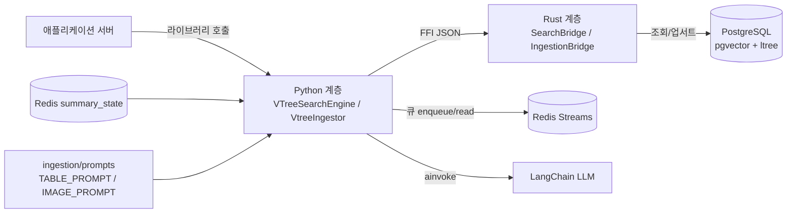
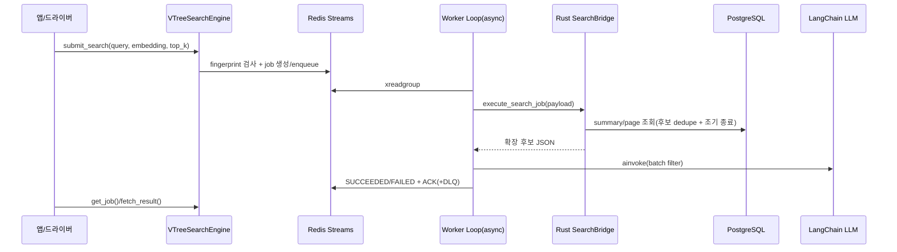

# Vtree Search

Vtree Search는 **Python 라이브러리 모드**로 동작하는 멀티모달 계층형 검색 엔진입니다.
애플리케이션 서버와 분리된 라이브러리 계층에서 검색/적재 실행 경로를 제공합니다.

## 무엇을 하는 프로그램인가

- 검색: `VTreeSearchEngine`이 Redis Streams 기반 큐로 검색 작업을 처리하고, Rust 파이프라인 + LLM 필터로 결과를 반환합니다.
- 적재: `VtreeIngestor`가 문서를 파싱하고 표/이미지를 LLM으로 주석한 뒤, summary/page 노드를 PostgreSQL에 업서트합니다.
- 상태 관리: 적재 중간 상태(`summary_state`)를 Redis에 기록해 진행률 추적/복구 기반을 제공합니다.

## 전체 동작 구조



## 검색 실행 흐름



## 적재 실행 흐름

```mermaid
flowchart TD
    A[run-ingestion.py] --> B[.env 로드]
    B --> C[IngestionConfig 구성]
    C --> D[Gemini 모델명 + API Key 로드]
    D --> E[VtreeIngestor.upsert_document_from_path]
    E --> F[writer lock 획득<br/>sumstate:{doc}:{ver}:lock]
    E --> G[SourceParser<br/>PDF/DOCX/MD 파싱]
    G --> H[LangChain ainvoke + TABLE/IMAGE_PROMPT]
    H --> I[헤딩 기반 sub-ch 생성 + title 생성]
    I --> J[summary_state<br/>PAGE -> SUBCH -> CH -> DOC(DRAFT)]
    J --> K[Rust IngestionBridge.execute]
    K --> L[(PostgreSQL summary/page 업서트)]
    L --> M[summary_state DOC(FINAL)/SUCCEEDED]
```

## 부하 제어 기본값

- 큐 모델: Redis Streams + Consumer Group
- 보장: At-least-once
- 임계치: `QUEUE_MAX_LEN=200`, `QUEUE_REJECT_AT=180`
- 재시도: 3회, 지수 백오프(`200ms`~`2s`), 초과 시 DLQ
- 포화 시 예외: `QueueOverloadedError`
- 중복 제출: 동일 질의/벡터/top-k/metadata fingerprint는 기존 `PENDING/RUNNING/SUCCEEDED` job 재사용
- 검색 조기 종료: `SEARCH_CANDIDATE_POOL_FACTOR`, `SEARCH_EARLY_STOP_MIN_ENTRIES` 기준

## `.env` 정책

- 라이브러리 본체는 `.env`를 직접 읽지 않습니다.
- 루트 `.env`는 드라이버 코드에서만 읽습니다.
  - [`scripts/run-search.py`](scripts/run-search.py)
  - [`scripts/run-ingestion.py`](scripts/run-ingestion.py)
- 샘플 키는 [`.env.example`](.env.example)을 사용합니다.
- Postgres 키(연결 + 스키마):
  - `POSTGRES_HOST`, `POSTGRES_PORT`, `POSTGRES_USER`, `POSTGRES_PASSWORD`, `POSTGRES_DATABASE`
  - `VTREE_SUMMARY_TABLE`, `VTREE_PAGE_TABLE`, `VTREE_EMBEDDING_DIM`
  - `POSTGRES_POOL_MIN`, `POSTGRES_POOL_MAX`, `POSTGRES_CONNECT_TIMEOUT_MS`, `POSTGRES_STATEMENT_TIMEOUT_MS`
- Redis 키(큐 + 모듈 태그):
  - `REDIS_HOST`, `REDIS_PORT`, `REDIS_DB`, `REDIS_USERNAME`, `REDIS_PASSWORD`, `REDIS_USE_SSL`
  - `REDIS_STREAM_SEARCH`, `REDIS_STREAM_SEARCH_DLQ`, `REDIS_CONSUMER_GROUP`
  - `REDIS_MODULE_SEARCH`, `REDIS_MODULE_INGESTION`
  - 현재 검색 잡 상태 해시(`job:{id}`)에는 `REDIS_MODULE_SEARCH` 값이 기록됩니다.
- 검색 실행 제어 키:
  - `QUEUE_MAX_LEN`, `QUEUE_REJECT_AT`, `JOB_RESULT_TTL_SEC`, `WORKER_BLOCK_MS`
  - `WORKER_CONCURRENCY`, `JOB_MAX_RETRIES`, `JOB_RETRY_BASE_MS`, `JOB_RETRY_MAX_MS`
  - `SEARCH_CANDIDATE_POOL_FACTOR`, `SEARCH_EARLY_STOP_MIN_ENTRIES`
- 적재 실행 제어 키:
  - `INGEST_MAX_CHUNK_CHARS`, `INGEST_SAMPLE_PER_EXTENSION`
  - `INGEST_ENABLE_TABLE_ANNOTATION`, `INGEST_ENABLE_IMAGE_ANNOTATION`
  - `INGEST_ASSET_OUTPUT_DIR`, `SUMMARY_STATE_TTL_SEC`, `SUMMARY_STATE_LOCK_TTL_SEC`
- LLM은 Gemini 기준으로 아래 키를 사용합니다.
  - `GOOGLE_API_KEY`
  - `SEARCH_LLM_MODEL`
  - `INGESTION_LLM_MODEL`
- LLM `temperature`는 드라이버 코드에서 고정값(`0.0`)입니다.

## 라이브러리 직접 주입 예시

```python
from langchain_google_genai import ChatGoogleGenerativeAI
from vtree_search import VTreeSearchEngine, VtreeIngestor

llm = ChatGoogleGenerativeAI(model="gemini-1.5-flash", temperature=0)
search_engine = VTreeSearchEngine(config=search_config, llm=llm)
ingestor = VtreeIngestor(config=ingestion_config, llm=llm)
```

현재 레포의 드라이버/문서 기준 LLM은 Gemini(`ChatGoogleGenerativeAI`)입니다.

## 디렉토리

```text
.
├── src_py/vtree_search/   # Python 공개 API/큐/파서/LLM 주입 계층
├── src_rs/                # Rust 실행 계층
├── docs/                  # 아키텍처/모듈/운영 문서
└── scripts/               # .env 기반 드라이버
```

## 문서 바로가기

- 아키텍처 청사진: [`docs/arch/blueprint.md`](docs/arch/blueprint.md)
- 런타임 시퀀스: [`docs/arch/how-this-works.md`](docs/arch/how-this-works.md)
- 이론 배경: [`docs/arch/theoretical_background.md`](docs/arch/theoretical_background.md)
- 운영/SLO/큐잉: [`docs/ops/queueing-and-slo.md`](docs/ops/queueing-and-slo.md)
- Python 개요: [`docs/python/README.md`](docs/python/README.md)
- Python LLM 주입: [`docs/python/llm_injection.md`](docs/python/llm_injection.md)
- Python 레퍼런스: [`docs/python/module_reference.md`](docs/python/module_reference.md)
- Rust 개요: [`docs/rust/README.md`](docs/rust/README.md)
- Rust 레퍼런스: [`docs/rust/module_reference.md`](docs/rust/module_reference.md)

## 드라이버 실행 예시

### 검색 드라이버

```bash
uv run python scripts/run-search.py \
  --query "문서에서 환불 정책을 찾아줘" \
  --embedding "0.1,0.2,0.3,0.4" \
  --top-k 5
```

### 적재 드라이버

```bash
uv run python scripts/run-ingestion.py \
  --document-id doc_001 \
  --parent-node-id sum_001 \
  --summary-node-id sum_001 \
  --summary-path doc_001.sum_001 \
  --summary-text "문서 요약" \
  --summary-embedding "0.1,0.2,0.3,0.4" \
  --input-root data/ingestion-doc \
  --sample
```

## 테스트 명령 핸드오프

- Python: `uv run pytest tests/python`
- Rust: `cargo test --test rust_tests`
